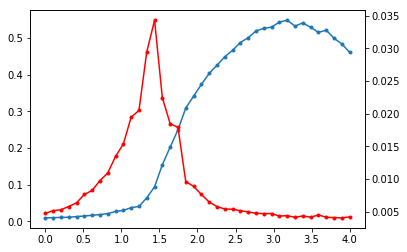

# Install

```bash
git clone https://github.com/stdogpkg/cukuramoto/ && cd cukuramoto && python setup.py install
```

# Running

```python
import igraph as ig
import numpy as np
from stdog.utils.misc import ig2sparse 

block_size=1024 # gpu parameter

num_couplings = 40
N = 10000

G = ig.Graph.Erdos_Renyi(N, 3/N)
adj = ig2sparse(G)
adj = adj.tocsr()
ptr, indices = adj.indptr, adj.indices


couplings = np.linspace(0, 4, num_couplings).astype("float32")
omegas = np.tan(( np.arange(1,N+1)*np.pi)/N - ((N+1.)*np.pi)/(2.0*N)  ).astype("float32")
phases = np.random.uniform(-np.pi, np.pi, int(num_couplings*N)).astype("float32")
```

```python
import cukuramoto

dt = 0.1
num_temps = 100
simulation = cukuramoto.Heuns(
    N, block_size, omegas, phases, couplings, 
    indices, ptr)

simulation.heuns(num_temps, dt)
order_parameter_list = simulation.get_order_parameter(num_temps, dt)
```

```python
order_parameter_list = order_parameter_list.reshape(num_couplings, num_temps)
    
r = np.mean(order_parameter_list, axis=1)
stdr = np.std(order_parameter_list, axis=1)
   
import matplotlib.pyplot as plt
plt.ion()
fig, ax1 = plt.subplots()
ax1.plot(couplings,r,'.-')
ax2 = ax1.twinx()
ax2.plot(couplings,stdr,'r.-')
plt.show()
```


